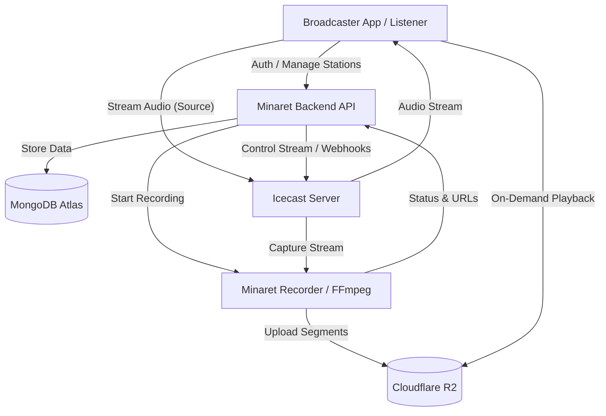

# Minaret Backend

[](https://opensource.org/licenses/ISC)
[](https://www.typescriptlang.org/)
[](https://nodejs.org/)
[](https://expressjs.com/)

**Minaret** is a robust, production-ready backend API for Mosque internet radio broadcasting. It serves as the bridge between broadcasters (Mosques), the Icecast streaming server, and listeners, managing authentication, station metadata, show scheduling, and real-time broadcasting control.

---

## 🏗️ Architecture

The system coordinates between the Broadcaster App, the Backend API, and the Icecast Streaming Server.


```mermaid
graph TD
    Client[Broadcaster App / Listener]
    API[Minaret Backend API]
    DB[(MongoDB Atlas)]
    Icecast[Icecast Server]
    Recorder[Minaret Recorder / FFmpeg]
    Storage[(Cloudflare R2)]

    Client -- "Auth / Manage Stations" --> API
    API -- "Store Data" --> DB
    Client -- "Stream Audio (Source)" --> Icecast
    API -- "Control Stream / Webhooks" --> Icecast
    Icecast -- "Audio Stream" --> Client

    API -- "Start Recording" --> Recorder
    Icecast -- "Capture Stream" --> Recorder
    Recorder -- "Upload Segments" --> Storage
    Recorder -- "Status & URLs" --> API
    Client -- "On-Demand Playback" --> Storage
```

## ✨ Key Features

- **🔐 Secure Authentication**: JWT-based auth with access and refresh token rotation.
- **📡 Station Management**: Create, update, and manage radio station metadata publicly.
- **📅 Smart Scheduling**: Schedule recurring shows and programs with flexible timing.
- **🎙️ Live Broadcast Control**: Seamlessly transition between live and offline states with real-time metadata updates.
- **� Recording & Playback**: Automatic stream recording with FFmpeg and R2, enabling on-demand playback of archived shows.
- **�🔧 Icecast Integration**: Tightly integrated with Icecast for authentication and stream management.
- **☁️ Production Ready**: Configured for deployment on VPS providers like kamatera or Hetzner.

## 🛠️ Tech Stack

- **Runtime**: Node.js 20+
- **Framework**: Express.js
- **Language**: TypeScript 5.x
- **Database**: MongoDB (Atlas)
- **Storage**: Cloudflare R2 (Audio Archives)
- **Streaming**: Icecast 2.4+
- **Audio Processing**: FFmpeg
- **Process Manager**: PM2

## 🚀 Getting Started

### Prerequisites

- **Node.js**: v20 or higher
- **MongoDB**: A running instance (local or Atlas)
- **Icecast**: An Icecast server running locally or remotely

### Installation

1.  **Clone the repository**

    ```bash
    git clone <repository-url>
    cd minaret-backend
    ```

2.  **Install dependencies**

    ```bash
    npm install
    ```

3.  **Configure Environment**
    Copy the example configuration and update it with your secrets.

    ```bash
    cp .env.example .env
    ```

    > **Important**: Ensure your `.env` connects to your running MongoDB instance and matches your Icecast admin credentials.

4.  **Run Locally**
    ```bash
    npm run dev
    ```

## 📡 Broadcasting & Streaming

### Connecting a Broadcasting Client

To broadcast audio to your station, you need a source client. You can use standard tools or build a custom app.

**Recommended Settings:**

- **Protocol**: Icecast / SHOUTcast
- **Hostname**: Your server IP (e.g., `127.0.0.1` or VPS IP)
- **Port**: `8000` (default Icecast port)
- **Mountpoint**: `/live` (or your specific station mount)
- **Username**: `source`
- **Password**: Your configured source password

### Icecast Info

This backend authenticates Icecast sources via webhooks (if configured) or standard mountpoint passwords. Ensure your Icecast XML configuration aligns with the backend's expected behavior.

## 📼 Recording Architecture (Minaret Recorder)

Minaret includes a dedicated auxiliary service, **Minaret Recorder**, designed to automatically capture and archive live Icecast streams. This service utilizes **FFmpeg** for efficient stream processing without re-encoding, ensuring minimal overhead.

### How FFmpeg is Processed:

1. **Trigger**: When a show begins, the Main API triggers the recording service via a `POST /start` request.
2. **FFmpeg Spawning**: The Recorder spawns an FFmpeg child process targeting the Icecast stream.
3. **Segmentation**: Instead of waiting for the stream to finish, FFmpeg uses the `segment` muxer (`-f segment`) to split the live audio directly into discrete, manageable chunks (e.g., 30-minute segments).
4. **Zero-Overhead Remuxing**: Using `-c:a copy`, FFmpeg avoids CPU-intensive audio decoding and re-encoding. It simply preserves the original audio codec and remuxes the data into the appropriate container format (e.g., `.mp3`, `.aac`, `.ogg`, `.flac`).
5. **Continuous Uploading**: As FFmpeg continuously outputs new chunks and logs them to a dynamically updated CSV segment list, the Node.js process watches this list and instantly uploads newly completed chunks to **Cloudflare R2 Object Storage**.
6. **API Callbacks**: The Recorder dispatches webhooks back to the main API, delivering the public R2 storage URLs and metadata for each segment.
7. **Graceful Shutdown**: When the show concludes, a `SIGINT` signal is sent to smoothly terminate the FFmpeg process, and a final status callback marks the recording session as complete.

## ☁️ Infrastructure & Deployment

For a reliable production broadcasting environment, we recommend using a **Virtual Private Server (VPS)**.

### Recommended Provider: [kamatera](https://kamatera.com)

**kamatera** offers high-performance VPS hosting suitable for audio streaming.

1.  Rent a VPS (Ubuntu 22.04/24.04 LTS recommended).
2.  Install Node.js, PM2, and your Icecast server.
3.  Deploy this backend using the guide below.

For a detailed deployment guide on Hetzner/Ubuntu, see **[DEPLOYMENT.md](./DEPLOYMENT.md)**.

## 🔌 API Endpoints

### Authentication

| Method | Endpoint                | Description                   |
| :----- | :---------------------- | :---------------------------- |
| `POST` | `/api/v1/auth/register` | Register a new mosque account |
| `POST` | `/api/v1/auth/login`    | Login and receive tokens      |
| `POST` | `/api/v1/auth/refresh`  | Refresh access token          |

### Stations

| Method  | Endpoint                      | Description              |
| :------ | :---------------------------- | :----------------------- |
| `POST`  | `/api/v1/stations`            | Create a new station     |
| `GET`   | `/api/v1/stations`            | List all public stations |
| `GET`   | `/api/v1/stations/me`         | Get my station details   |
| `PATCH` | `/api/v1/stations/me`         | Update station profile   |
| `POST`  | `/api/v1/stations/me/go-live` | Set status to Live       |

### Shows

| Method | Endpoint        | Description          |
| :----- | :-------------- | :------------------- |
| `GET`  | `/api/v1/shows` | List scheduled shows |
| `POST` | `/api/v1/shows` | Create a new show    |

## 📂 Project Structure

```
src/
├── config/         # Environment variables & DB config
├── controllers/    # Request logic & handlers
├── middleware/     # Auth checks, validation, error handling
├── models/         # Mongoose Data Models
├── routes/         # Express Route definitions
├── schemas/        # Zod Validation schemas
├── services/       # Business logic (optional layer)
└── utils/          # Helper functions & constants
```

## 📄 License

ISC © varletint
