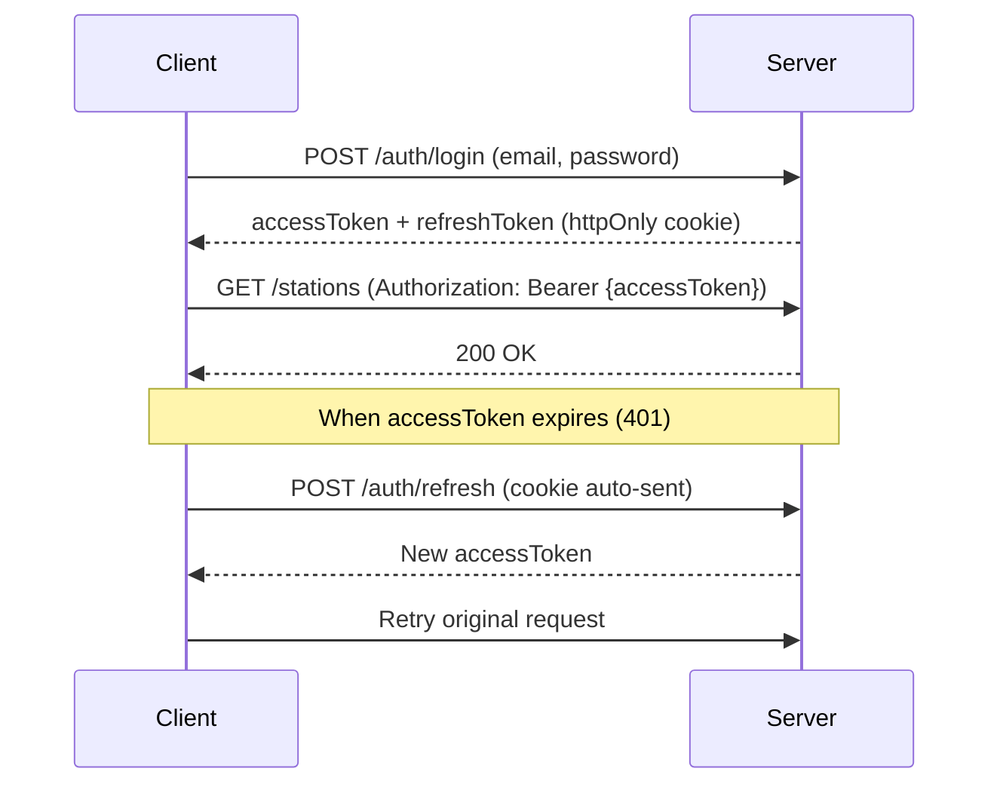

# Minaret Backend API Documentation

Base URL: `/api/v1`

## Authentication Flow



---

## Axios Setup (Recommended)

```typescript
import axios from "axios";

const api = axios.create({
  baseURL: "/api/v1",
  withCredentials: true, // IMPORTANT: Sends cookies with requests
});

let accessToken: string | null = null;

export const setAccessToken = (token: string | null) => {
  accessToken = token;
};

export const getAccessToken = () => accessToken;

// Request interceptor - attach access token
api.interceptors.request.use((config) => {
  if (accessToken) {
    config.headers.Authorization = `Bearer ${accessToken}`;
  }
  return config;
});

// Response interceptor - handle token refresh
api.interceptors.response.use(
  (response) => {
    // Auto-capture accessToken from login/register responses
    if (response.data?.data?.accessToken) {
      setAccessToken(response.data.data.accessToken);
    }
    return response;
  },
  async (error) => {
    const originalRequest = error.config;

    const isAuthEndpoint = [
      "/auth/login",
      "/auth/register",
      "/auth/refresh",
    ].some((path) => originalRequest.url?.includes(path));

    if (
      error.response?.status === 401 &&
      !originalRequest._retry &&
      !isAuthEndpoint
    ) {
      originalRequest._retry = true;

      try {
        const { data } = await api.post("/auth/refresh");
        setAccessToken(data.data.accessToken);
        originalRequest.headers.Authorization = `Bearer ${data.data.accessToken}`;
        return api(originalRequest);
      } catch {
        setAccessToken(null);
        return Promise.reject(error);
      }
    }
    return Promise.reject(error);
  }
);

export default api;
```

---

## Auth Endpoints

### Register

```http
POST /auth/register
```

**Request Body:**

```json
{
  "name": "Masjid Al-Noor",
  "email": "contact@masjidalnoor.org",
  "password": "securePassword123",
  "location": {
    "city": "Lagos",
    "country": "Nigeria",
    "address": "123 Main Street"
  },
  "contactPhone": "+234123456789"
}
```

**Success Response (201):**

```json
{
  "status": "success",
  "data": {
    "mosque": {
      "id": "507f1f77bcf86cd799439011",
      "name": "Masjid Al-Noor",
      "email": "contact@masjidalnoor.org",
      "slug": "masjid-al-noor"
    },
    "accessToken": "eyJhbGciOiJIUzI1NiIs..."
  }
}
```

> 🍪 **Cookie:** `refreshToken` is set as httpOnly cookie

---

### Login

```http
POST /auth/login
```

**Request Body:**

```json
{
  "email": "contact@masjidalnoor.org",
  "password": "securePassword123"
}
```

**Success Response (200):**

```json
{
  "status": "success",
  "data": {
    "mosque": {
      "id": "507f1f77bcf86cd799439011",
      "name": "Masjid Al-Noor",
      "email": "contact@masjidalnoor.org",
      "slug": "masjid-al-noor"
    },
    "accessToken": "eyJhbGciOiJIUzI1NiIs..."
  }
}
```

**Error Response (401):**

```json
{
  "status": "error",
  "message": "Invalid credentials"
}
```

---

### Refresh Token

```http
POST /auth/refresh
```

> No body required - refresh token is sent automatically via cookie

**Success Response (200):**

```json
{
  "status": "success",
  "data": {
    "accessToken": "eyJhbGciOiJIUzI1NiIs..."
  }
}
```

---

### Logout

```http
POST /auth/logout
```

**Success Response (200):**

```json
{
  "status": "success",
  "message": "Logged out successfully"
}
```

> 🍪 Clears the `refreshToken` cookie

---

### Get Current User

```http
GET /me
```

🔒 **Requires:** `Authorization: Bearer {accessToken}`

**Success Response (200):**

```json
{
  "status": "success",
  "data": {
    "mosque": {
      "id": "507f1f77bcf86cd799439011",
      "name": "Masjid Al-Noor",
      "email": "contact@masjidalnoor.org",
      "slug": "masjid-al-noor",
      "location": {
        "city": "Lagos",
        "country": "Nigeria"
      },
      "contactPhone": "+234123456789",
      "isActive": true,
      "createdAt": "2026-01-15T10:30:00.000Z"
    }
  }
}
```

---

## Station Endpoints

### Create Station

```http
POST /stations
```

🔒 **Requires Auth**

**Request Body:**

```json
{
  "name": "Al-Noor FM",
  "description": "Islamic lectures and Quran recitations",
  "settings": {
    "bitrate": "128",
    "format": "mp3",
    "isPublic": true
  }
}
```

**Success Response (201):**

```json
{
  "status": "success",
  "data": {
    "station": {
      "_id": "...",
      "name": "Al-Noor FM",
      "slug": "al-noor-fm",
      "description": "Islamic lectures...",
      "isLive": false,
      "settings": { "bitrate": 128, "format": "mp3", "isPublic": true }
    }
  }
}
```

---

### List Public Stations

```http
GET /stations
```

**Success Response (200):**

```json
{
  "status": "success",
  "results": 5,
  "data": {
    "stations": [
      {
        "name": "Al-Noor FM",
        "slug": "al-noor-fm",
        "description": "...",
        "isLive": true,
        "currentTrack": {
          "title": "Surah Al-Baqarah",
          "artist": "Mishary Rashid"
        }
      }
    ]
  }
}
```

---

### Get My Station

```http
GET /stations/me
```

🔒 **Requires Auth**

---

### Get Station by Slug

```http
GET /stations/:slug
```

---

### Update My Station

```http
PATCH /stations/me
```

🔒 **Requires Auth**

**Request Body (all fields optional):**

```json
{
  "name": "New Station Name",
  "description": "Updated description",
  "settings": {
    "isPublic": false
  }
}
```

---

### Update Now Playing

```http
PATCH /stations/me/now-playing
```

🔒 **Requires Auth**

```json
{
  "title": "Surah Al-Mulk",
  "artist": "Abdul Rahman Al-Sudais",
  "album": "Quran Recitation"
}
```

---

### Go Live / Go Offline

```http
POST /stations/me/go-live
POST /stations/me/go-offline
```

🔒 **Requires Auth**

---

### Get Now Playing (Public)

```http
GET /stations/:slug/now-playing
```

---

## Show Endpoints

### Create Show

```http
POST /shows
```

🔒 **Requires Auth** (must have a station first)

**Request Body:**

```json
{
  "title": "Friday Khutbah",
  "description": "Weekly Friday sermon",
  "hostName": "Imam Abdullah",
  "scheduledStart": "2026-01-24T13:00:00.000Z",
  "scheduledEnd": "2026-01-24T14:00:00.000Z",
  "isRecurring": true,
  "recurrence": {
    "pattern": "weekly",
    "daysOfWeek": [5]
  },
  "tags": ["khutbah", "friday", "sermon"]
}
```

---

### List Shows

```http
GET /shows?stationSlug=al-noor-fm&upcoming=true&limit=20
```

| Param         | Description                  |
| ------------- | ---------------------------- |
| `stationSlug` | Filter by station            |
| `upcoming`    | `true` for future shows only |
| `limit`       | Max results (default: 20)    |

---

### Get My Shows

```http
GET /shows/my
```

🔒 **Requires Auth**

---

### Get Today's Schedule

```http
GET /shows/schedule/today?stationSlug=al-noor-fm
```

---

### Get / Update / Delete Show

```http
GET /shows/:id
PATCH /shows/:id
DELETE /shows/:id
```

🔒 PATCH/DELETE require auth & ownership

---

### Start / End Show

```http
POST /shows/:id/start
POST /shows/:id/end
```

🔒 **Requires Auth** - Also updates station's `isLive` status

---

## Error Responses

All errors follow this format:

```json
{
  "status": "error",
  "message": "Error description here"
}
```

| Status | Meaning                              |
| ------ | ------------------------------------ |
| 400    | Validation error                     |
| 401    | Unauthorized (missing/invalid token) |
| 403    | Forbidden (not owner)                |
| 404    | Resource not found                   |
| 409    | Conflict (duplicate)                 |

---

## Frontend Usage Examples

### Auth Context Check (on app load)

```typescript
const checkAuth = async () => {
  try {
    const { data } = await api.get("/me");
    return data.data.mosque;
  } catch {
    return null; // Not authenticated
  }
};
```

### Login

```typescript
const login = async (email: string, password: string) => {
  const { data } = await api.post("/auth/login", { email, password });
  // accessToken is auto-captured by interceptor
  return data.data.mosque;
};
```

### Logout

```typescript
const logout = async () => {
  await api.post("/auth/logout");
  setAccessToken(null);
};
```

### Protected Request

```typescript
// Just make the request - interceptor handles token refresh automatically
const getMyStation = async () => {
  const { data } = await api.get("/stations/me");
  return data.data.station;
};
```
